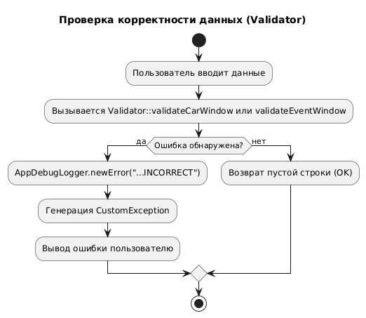
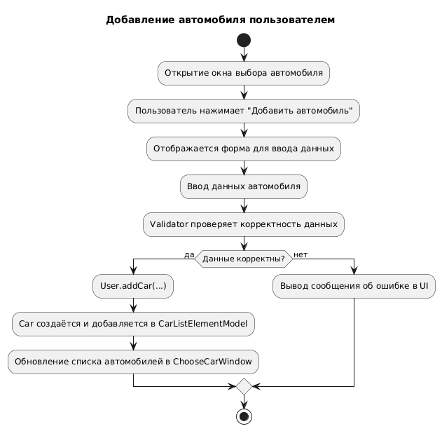
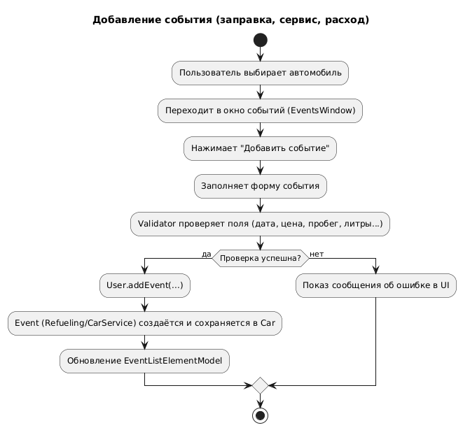
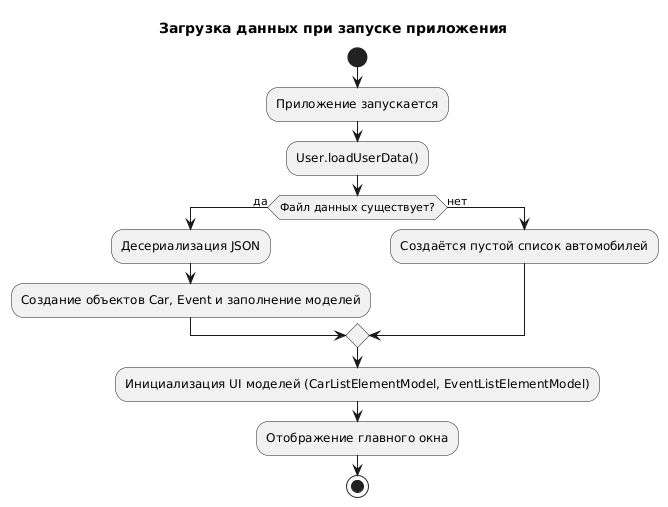
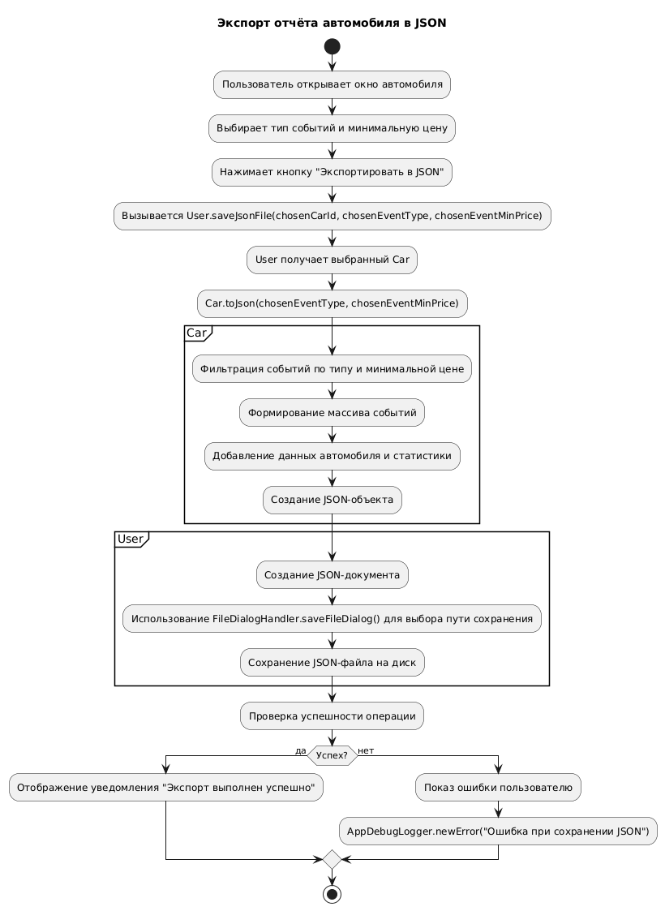

# 📊 Диаграммы активностей — CountrySearch

## 📑 Содержание

1. [Валидация](#1)
2. [Добавление автомобиля](#2)
3. [Добавление события](#3)
4. [Загрузка данных](#4)
5. [Сохранение данных](#5)
6. [Экспорт отчета](#6)

---

### 1. Проверка корректности данных

---

### 2. Добавление автомобиля

---

### 3. Добавление события

---

### 4. Загрузка данных при запуске

---

### 5. Сохранение данных при выходе

---

### 6. Экспорт отчета в JSON

