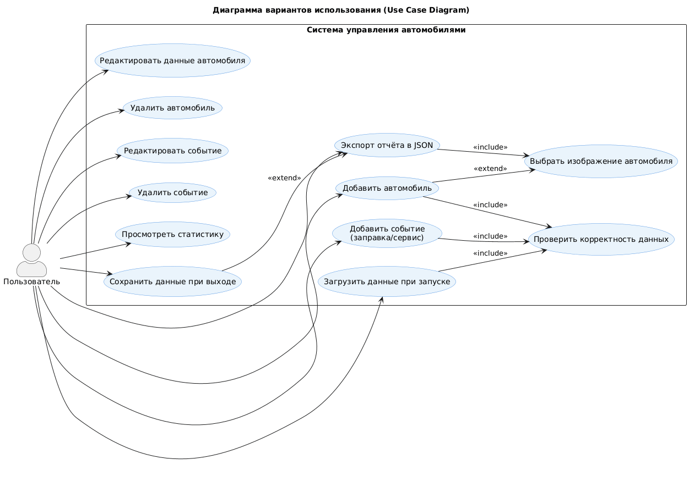

# 🚗 Диаграмма вариантов использования — CarManager

---

## 📚 Глоссарий

| Термин            | Определение                                                                                                               |
| ----------------- | ------------------------------------------------------------------------------------------------------------------------- |
| **Пользователь**  | Человек, использующий настольное приложение для управления своими автомобилями и записями об их обслуживании.             |
| **Автомобиль**    | Сущность, представляющая транспортное средство с атрибутами: название, год, пробег, тип топлива, объём бака, изображение. |
| **Событие**       | Запись, описывающая действие, связанное с автомобилем (заправка, ремонт, обслуживание и т.д.).                            |
| **Заправка**      | Подкласс события, фиксирующий количество литров, цену за литр и тип топлива.                                              |
| **Сервис**        | Подкласс события, описывающий тип обслуживания (ремонт, диагностика, шиномонтаж и т.п.).                                  |
| **Статистика**    | Совокупность расчётных данных автомобиля (затраты, пробег, расходы на топливо и обслуживание).                            |
| **Модель списка** | UI-компонент (QAbstractListModel), отображающий коллекцию автомобилей или событий в интерфейсе.                           |

---

# 📑 Содержание

1. [Актёры](#1)
2. [Варианты использования](#2)
   2.1 [Просмотреть список автомобилей](#2.1)
   2.2 [Добавить автомобиль](#2.2)
   2.3 [Редактировать данные автомобиля](#2.3)
   2.4 [Удалить автомобиль](#2.4)
   2.5 [Просмотреть события автомобиля](#2.5)
   2.6 [Добавить событие](#2.6)
   2.7 [Редактировать событие](#2.7)
   2.8 [Удалить событие](#2.8)
   2.9 [Просмотреть статистику](#2.9)
   2.10 [Экспортировать отчёт в JSON](#2.10)
   2.11 [Сохранить данные при выходе](#2.11)
   2.12 [Загрузить данные при запуске](#2.12)

---

## 🎭 1. Актёры

| Актёр            | Описание                                                                                                    |
| ---------------- | ----------------------------------------------------------------------------------------------------------- |
| **Пользователь** | Человек, использующий приложение для добавления автомобилей, учёта заправок, сервисов и анализа статистики. |

---

## 🎬 2. Варианты использования

### 2.1 Просмотреть список автомобилей

**Описание:** Отображение всех автомобилей пользователя.
**Предусловия:** Приложение запущено, пользователь находится в окне выбора автомобиля.

**Основной поток:**

* При запуске `User.loadUserData()` загружает сохранённые данные.
* `CarListElementModel` наполняется объектами `Car`.
* В интерфейсе (`ChooseCarWindow`) отображается список с изображениями и характеристиками автомобилей.
* Пользователь видит кнопки **“Добавить”, “Редактировать”, “Удалить”**.

**Альтернативный поток А1:** Если автомобилей нет, отображается пустой список и сообщение *«Нет зарегистрированных автомобилей»*.

---

### 2.2 Добавить автомобиль

**Описание:** Создание нового автомобиля.
**Предусловия:** Пользователь нажал кнопку **“Добавить автомобиль”**.

**Основной поток:**

* Открывается форма с полями: название, год выпуска, пробег, тип топлива, объём бака, изображение.
* При сохранении вызывается `Validator.validateCarWindow()` для проверки введённых данных.
* При корректных данных вызывается `User.addCar()`, создаётся объект `Car`, добавляется в `CarListElementModel`.
* Отображается сообщение *«Автомобиль добавлен»*.

**Альтернативный поток А2:** При ошибке валидации выводится сообщение об ошибке (например, *«Неверный год выпуска»*).

---

### 2.3 Редактировать данные автомобиля

**Описание:** Обновление информации об автомобиле.
**Предусловия:** Пользователь выбрал автомобиль и нажал кнопку **“Редактировать”**.

**Основной поток:**

* Приложение подставляет текущие данные в форму.
* Пользователь изменяет поля.
* При нажатии **“Сохранить”** данные проверяются и обновляются методом `User.editChosenCarInfo()`.
* Обновлённые данные отображаются в списке.

**Альтернативный поток А3:** При отмене редактирования форма закрывается без изменений.

---

### 2.4 Удалить автомобиль

**Описание:** Удаление выбранного автомобиля.
**Основной поток:**

* Пользователь подтверждает удаление.
* Вызывается `User.deleteChosenCar()`.
* Автомобиль и связанные с ним события удаляются.
* Список автомобилей обновляется.

---

### 2.5 Просмотреть события автомобиля

**Описание:** Просмотр всех событий, связанных с выбранным автомобилем.
**Предусловия:** Пользователь выбрал автомобиль в списке.

**Основной поток:**

* `User.getChosenCarEventList()` возвращает события выбранного авто.
* В `EventsWindow` отображаются записи: дата, тип, стоимость, комментарий.
* Пользователь может добавить, отредактировать или удалить событие.

---

### 2.6 Добавить событие

**Описание:** Добавление новой заправки или обслуживания.
**Основной поток:**

* Пользователь открывает окно добавления события.
* Заполняет форму (тип, дата, пробег, цена и т.п.).
* Система вызывает `Validator.validateEventWindow()`.
* При корректных данных — `User.addEvent()` создаёт объект `Refueling` или `CarService` и добавляет в список.
* Модель событий (`EventListElementModel`) обновляется.

---

### 2.7 Редактировать событие

**Описание:** Изменение существующей записи события.
**Основной поток:**

* Пользователь выбирает событие и нажимает **“Редактировать”**.
* Данные подставляются в форму.
* После редактирования вызывается `User.editChosenEventInfo()`.
* Обновлённые данные сохраняются и отображаются.

---

### 2.8 Удалить событие

**Описание:** Удаление события автомобиля.
**Основной поток:**

* Пользователь подтверждает действие.
* `User.deleteChosenEvent()` удаляет запись из контейнера `CustomContainer<Event>`.
* Интерфейс обновляется.

---

### 2.9 Просмотреть статистику

**Описание:** Просмотр общих расходов и параметров автомобиля.
**Основной поток:**

* Пользователь выбирает пункт **“Статистика”**.
* `Car.updateStatistics()` пересчитывает затраты.
* В интерфейсе отображаются суммы по категориям: топливо, сервис, прочее.

---

### 2.10 Экспортировать отчёт в JSON

**Описание:** Сохранение информации об автомобиле в JSON-файл.
**Основной поток:**

* Пользователь нажимает **“Экспорт JSON”**.
* Вызывается `User.saveJsonFile()` → `Car.toJson()` → `FileDialogHandler.saveFileDialog()`.
* Данные сохраняются на диск.

**Альтернативный поток А4:** При ошибке записи появляется сообщение *«Ошибка при сохранении»*.

---

### 2.11 Сохранить данные при выходе

**Описание:** Автоматическое сохранение состояния при завершении приложения.
**Основной поток:**

* При завершении `MyApp` вызывает `User.saveUserData()`.
* Все автомобили и события сериализуются в JSON.

---

### 2.12 Загрузить данные при запуске

**Описание:** Восстановление состояния пользователя при запуске.
**Основной поток:**

* `User.loadUserData()` читает JSON из файла.
* Объекты `Car` и `Event` создаются из сохранённых данных.
* UI обновляется.

---
